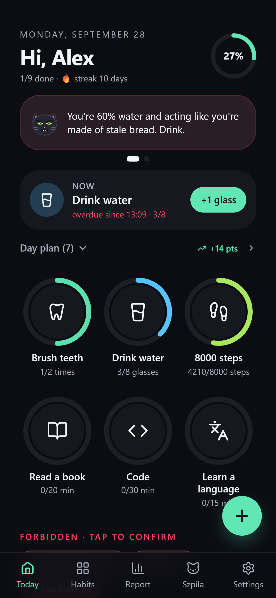
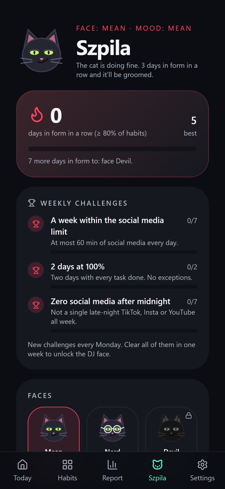
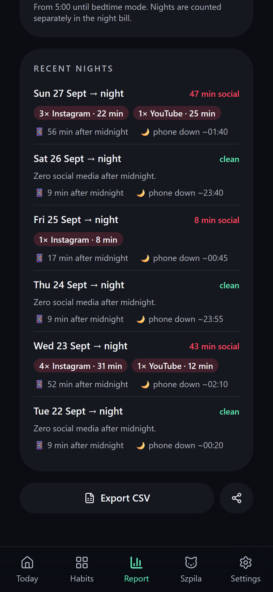
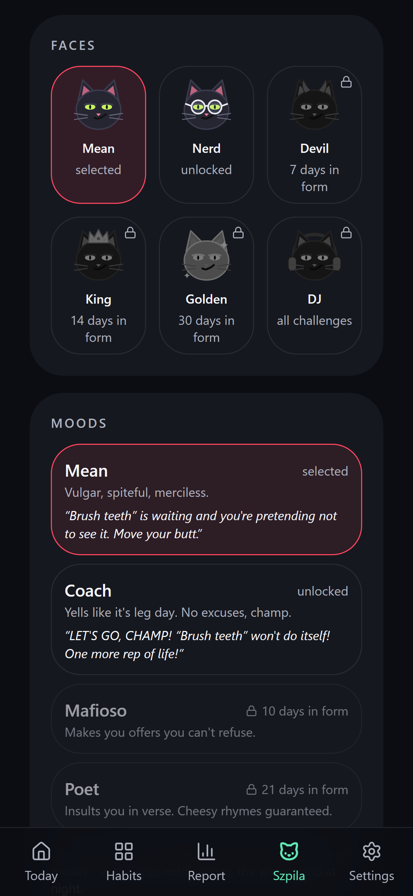
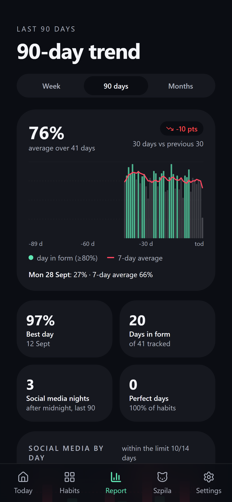
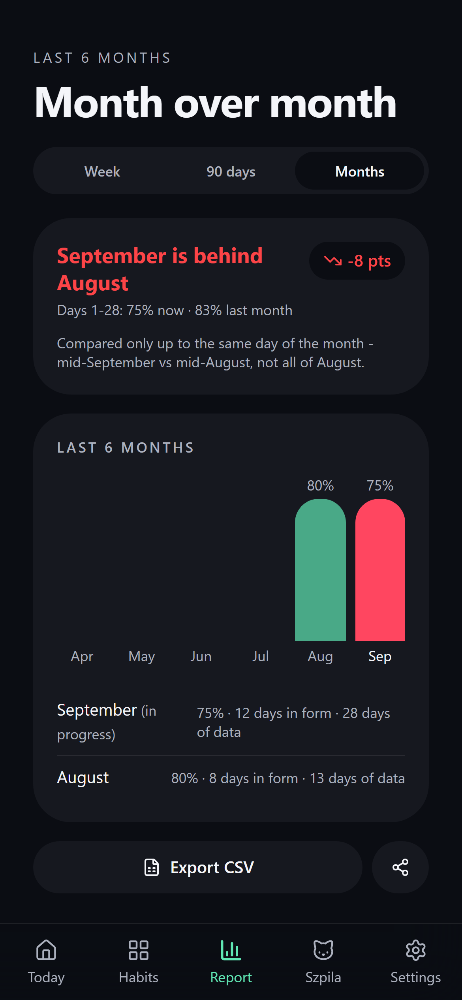
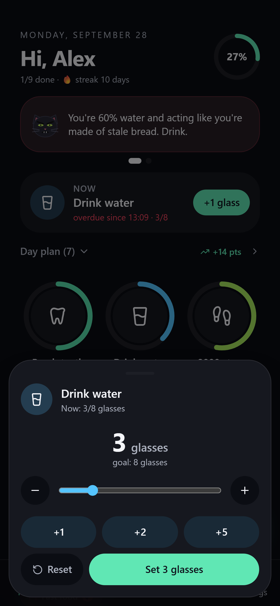
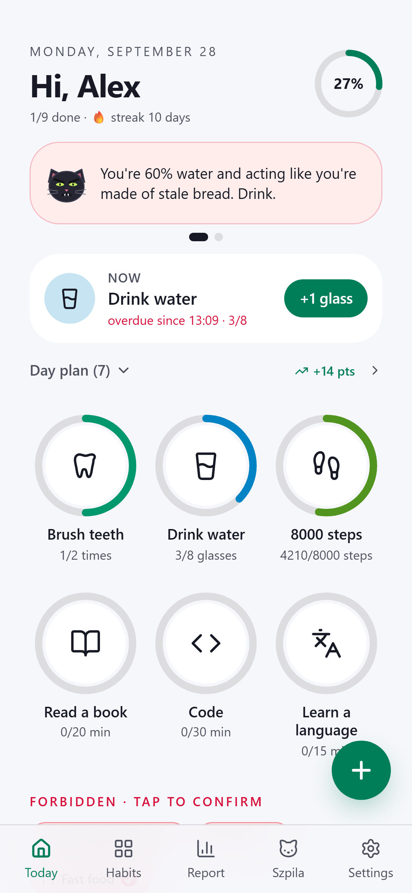
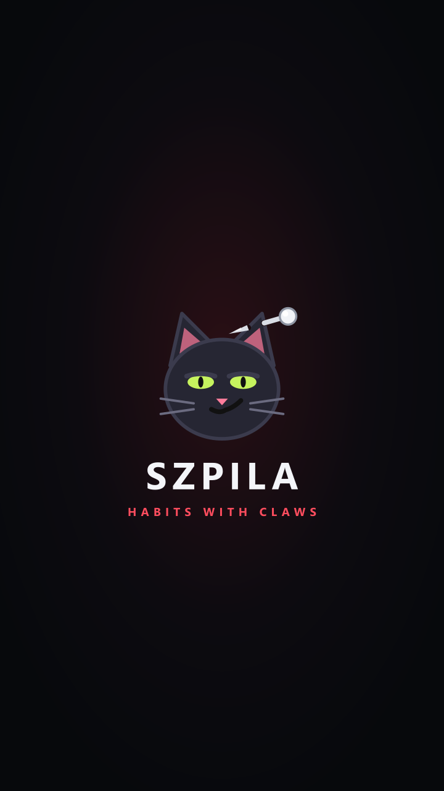

<div align="center">


# Szpila

**Habits with claws.**
Do what you want to do. Quit what you don't. Slack off, and a mean cat will remind you. Painfully.

[Polski](README.md) · **English**

<br />

[](https://github.com/pi0trdotsys/Glow-Habit-Widget/releases/latest)
&nbsp;

&nbsp;


<br />


&nbsp;&nbsp;

&nbsp;&nbsp;


</div>

<br />

## ◉ Szpila 😼

_Szpila_ is Polish for "pin" - and for a cheap shot. It's a mean cat living in
your phone. It jabs you when habits are gathering dust, and it has a line for
everything: unbrushed teeth, 2,000 steps at 6 pm, fries. The longer you wait,
the harsher it gets. It remembers your slips. On Sunday it writes a weekly
roast you won't want to read.

Get it done and you get praise. Snarky, but praise.

> **Szpila swears by default.** Prefer it polite? Settings → Szpila → **"Gentle"**.
> Plus 3, 5 or 8 jabs a day and quiet hours.

## ◉ After midnight there's no mercy

- **Bedtime mode.** At 23:30 Szpila says _"put the phone down in 30 min"_
  and starts watching right away, counting down to midnight.
- **Night guard.** Opening TikTok at 00:40? **Szpila pops up instantly**,
  not tomorrow morning. A line for that exact app, harsher every 5 minutes.
- **The block.** Still scrolling after the third jab? The cat **covers the
  whole app**. Pick **"Going to bed"** or **hold a button for 10 seconds** if
  you really must - and look yourself in the eye while you do.
- **The night bill.** Every morning: _"3× Instagram (22 min) · 1× YouTube
  (25 min) · 61 min on the phone after midnight · phone down around 1:40"_.
  With commentary.
- **Fair judging.** "Scrolling in bed" counts **social media only**. An alarm,
  music or a sleep podcast is not a slip. Only real phone sessions count: a
  notification lighting up the screen or a scheduled power-off doesn't pretend
  you're awake.

## ◉ By day too

- **Mornings: habits first, then Instagram.** From 5:00 social media stays
  blocked until you tick off your morning habits (teeth and the first glass of
  water by default) - right from the block.
- **Daily limit**, e.g. 60 minutes of social media. A heads-up 10 minutes
  before, jabs past the limit, the block after the third. Today shows a
  _"42/60 min"_ counter, the report how many days you stayed within it.

## ◉ A cat that grows with you

- **A day in form** = at least 80% of your habits. Streaks of those unlock
  **new faces** (Nerd, Devil, King, Golden, DJ) and **moods**: the Coach yells
  like it's leg day, the Mafioso makes offers you can't refuse, and the Poet
  insults you in rhyme.
- **Three weekly challenges**, fresh every Monday: 5 out of 7 days, a clean
  week, zero social media after midnight, beat last week.
- **Cat at home**: on a streak it's groomed, glossy and wearing a bow tie.
  After a week of slips it's scruffy, band-aided and offended. You'll see it on
  the widget too.

<div align="center">

&nbsp;&nbsp;

&nbsp;&nbsp;

</div>

## ◉ A day that plans itself

Open the app and see only what matters: today's progress, **one status card**
(the jab, the night bill, the morning lock, the limit - swipe sideways) and
**one habit for right now**. The rest of the day hides in a folding **plan**.
Eight glasses of water? Spread evenly from morning to night.

- **Hold** a tile: +1, done.
- **Hold longer**: +1 / +2 / +5 or a slider to enter an amount in one go.
- **Swipe sideways**: undo the last entry.
- A buzz on every step, **confetti when the day is complete**, and the cat on
  the card cheers every tick.

<div align="center">

&nbsp;&nbsp;

</div>

## ◉ Forbidden. In red.

Fast food, scrolling in bed, sweets, porn, skipping meals, impulse shopping,
gambling. Add what you **don't** want to do and set a limit, e.g. "at most once
a week".

The rule is simple and merciless: every day you confirm **"clean today"**.
No confirmation = a slip. You can still settle yesterday in the morning, until
noon.

## ◉ Numbers that tell the truth

- **Week vs week**, but fair: Wednesday 14:35 against Wednesday 14:35 last
  week, not against a whole finished week.
- **90-day trend** with a 7-day average and the last 30 days vs the 30 before.
- **Month vs month** up to the same day, and 6 months on one chart.
- **Links between habits**: _"The day after a late night on the phone you walk
  4,000 fewer steps"_.
- **CSV export** in one tap, straight into Excel or Sheets.

## ◉ No need to open the app

- **Four widgets**: the mean cat 4×1, next habit 1×1 or 2×1 (with the cat,
  the delay and a rotating line: a jab, your streak, progress, the limit,
  what's next), icons with a progress ring, and a list. You complete by
  holding, so an accidental tap breaks nothing.
- **Widget settings** when you add one: background transparency to match your
  wallpaper, and what the rotating line shows.
- **Ongoing notification** with a progress bar, the plan and quick buttons:
  **"+1 glass"**, **"+15 min Read"**, **"✓ Brush"**.
- **Evening review** of forbidden habits in one notification.
- **Steps from Health Connect**: Google Fit, Samsung Health or Mi Fitness fill
  them in for you.

## ◉ Polski i English, light or dark

The whole app, Szpila's jabs (yes, the swearing too), notifications and widgets
speak **Polish and English**. Pick the language at first launch or any time in
Settings. Theme: **dark, light or like your phone**. Settings are split into
four tabs: Szpila, Guard, Notifications, Data.

<br />

---

<br />

## ▸ Install

1. Download **`szpila-….apk`** from [Releases](https://github.com/pi0trdotsys/Glow-Habit-Widget/releases/latest).
2. Open it on your phone and allow installs from this source.
3. Launch Szpila, pick a language, tell it your name and allow notifications.

You start with ready-made habits: brush teeth, drink water, 8000 steps, read,
code, learn a language, scrolling in bed and fast food. Edit them, delete them
or add your own from 20+ templates.

> **Coming from Loop 2.x?** It's the same app under a new name. Install over
> it and your data stays. From 1.x, uninstall the old version first.

## ▸ The first 2 minutes that make the difference

|     | Where                                                    | Why                                                                        |
| --- | -------------------------------------------------------- | -------------------------------------------------------------------------- |
| 🔔  | Allow notifications                                      | Jabs, progress bar, the night bill                                         |
| 📱  | Settings → Guard → Automatic tracking → **Open**         | Night guard, night bill, mornings, daily limit                             |
| 🛑  | Settings → Guard → Night guard → **Allow**               | Full-screen block after the 3rd jab                                        |
| 🌅  | Settings → Guard → **Social media by day**               | Morning habits and the daily limit                                         |
| 👣  | Settings → Guard → Automatic tracking → **Connect**      | Steps fill in by themselves                                                |
| 🔋  | System settings → Battery → Szpila → **No restrictions** | Jabs and the night guard arrive on time (especially Xiaomi, POCO, Samsung) |
| ➕  | Long-press the home screen → **Widgets** → Szpila        | The cat always in sight                                                    |

## ▸ Your data is yours

Everything stays on your phone. No account, no cloud, no ads, no tracking.
Szpila makes a daily backup to **Downloads/Szpila** (last 7 days). You can also
save a backup by hand, send it to Drive or by email, and restore it in one tap.

<br />

<div align="center">

**Szpila** · habits with claws



</div>

<br />

<details>
<summary><b>For developers</b></summary>

<br />

React 19 + TanStack Start + Tailwind v4 in a **Capacitor 8** shell. Widgets,
notifications, the night guard (foreground service + usage stats), the block
(overlay over other apps), Health Connect and screen time are native
(Java/Kotlin). Data lives in `localStorage` and is mirrored to
`SharedPreferences`, where the native side reads it
([`src/lib/widget/bridge.ts`](src/lib/widget/bridge.ts)). Translations are
inline: `L("polski", "English")` ([`src/lib/i18n.ts`](src/lib/i18n.ts)), and
`WidgetShared.tr()` on the native side.

```bash
bun install
bun run dev              # web, http://localhost:8080
bun run test             # logic tests (planner, forbidden habits, gamification, stats, nights, guard, i18n, UX)
bun run test:e2e         # build + tests on the built app in headless Edge/Chrome

bun run build:cap        # static build for Capacitor
bun x cap sync android
cd android
./gradlew :app:assembleRelease
./gradlew testReleaseUnitTest   # native logic, e.g. the Java planner must match TS (tests/planner-vectors.json)
```

Signing: `android/keystore.properties` (not in git; `storeFile`, `storePassword`,
`keyAlias`, `keyPassword`). One key for every build, so updates install without
uninstalling. JDK 21 required.

</details>
