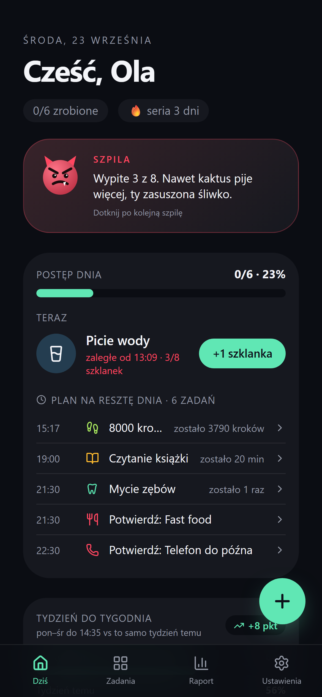
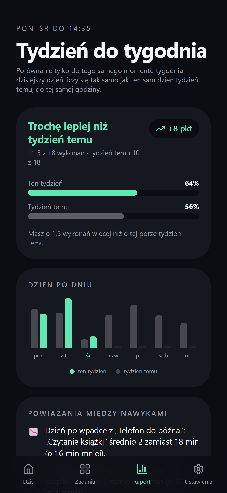
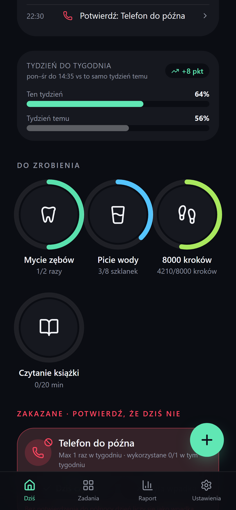
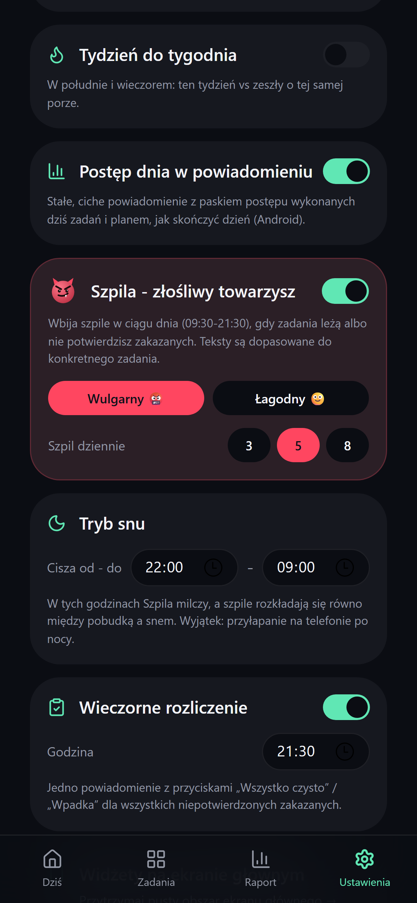
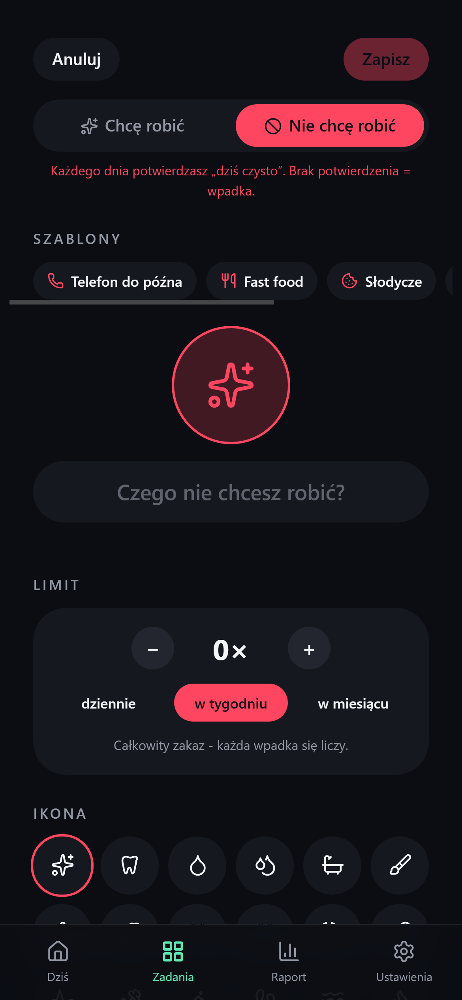
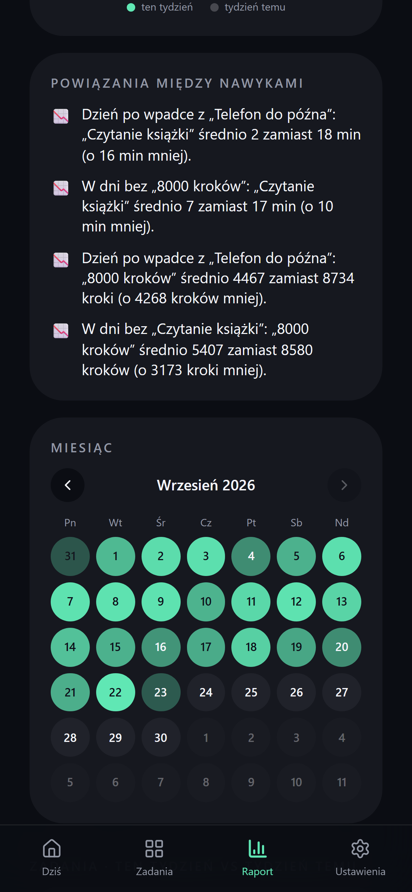
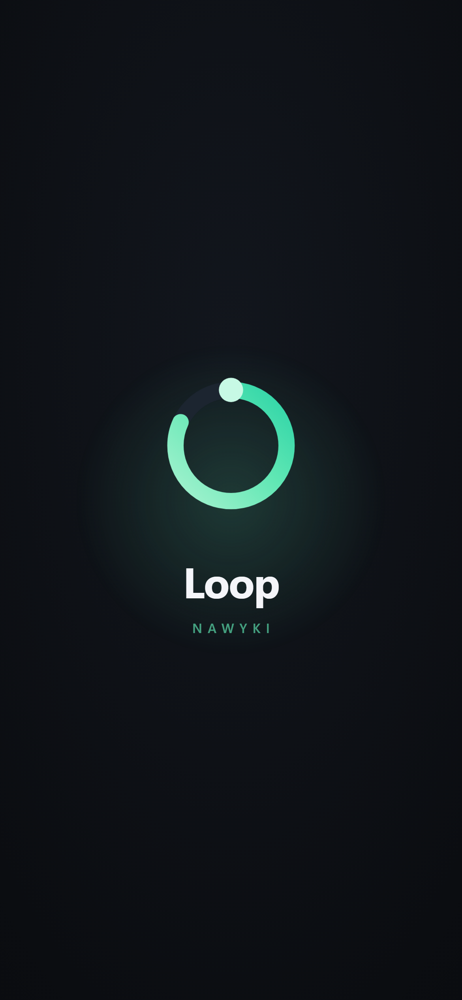

<div align="center">


# Loop

**Nawyki, które same się pilnują.**
Rób to, co chcesz robić. Rzuć to, czego nie chcesz. A jak odpuścisz, usłyszysz o tym.

<br />

[](https://github.com/pi0trdotsys/Glow-Habit-Widget/releases/latest)
&nbsp;

&nbsp;


<br />


&nbsp;&nbsp;

&nbsp;&nbsp;


</div>

<br />

## ◉ Dzień, który układa się sam

Otwierasz Loop i od razu wiesz, co teraz. Aplikacja zna twoje zadania, porę dnia
i to, kiedy zwykle je robisz, więc podsuwa **jedno następne zadanie** i
**plan na resztę dnia**. Osiem szklanek wody? Rozłoży je równo od rana do wieczora.

Przytrzymaj kafelek, a zadanie wskakuje na swoje miejsce. Ile razy, ile minut,
ile kroków - ustawiasz po swojemu.

## ◉ Zakazane. Na czerwono.

Fast food, telefon do późna, słodycze. Dodaj to, czego **nie** chcesz robić,
i ustaw limit, np. „najwyżej raz w tygodniu”.

Zasada jest prosta i bezlitosna: każdego dnia potwierdzasz **„dziś czysto”**.
Brak potwierdzenia do północy = wpadka.

## ◉ Szpila 😈

Twój złośliwy towarzysz. Wbija szpile w ciągu dnia, gdy zadania leżą odłogiem,
i ma tekst na każdą okazję: na nieumyte zęby, na 2000 kroków o 18:00, na frytki.
Im dłużej zwlekasz, tym ostrzej. Pamięta twoje wpadki. W niedzielę robi
podsumowanie tygodnia, którego nie chcesz przeczytać.

A gdy coś zrobisz, dostaniesz pochwałę. Złośliwą, ale zawsze.

> **Szpila domyślnie przeklina.** Jeśli wolisz grzeczniej, przełącz ją w
> Ustawieniach na **„Łagodny”**. Możesz też wybrać 3, 5 albo 8 szpil dziennie
> i godziny ciszy.

<div align="center">

&nbsp;&nbsp;

&nbsp;&nbsp;

</div>

## ◉ Liczby, które mówią prawdę

- **Tydzień do tygodnia**, ale uczciwie: w środę o 14:35 porównujesz się ze
  środą 14:35 sprzed tygodnia, a nie z całym zakończonym tygodniem.
- **Powiązania między nawykami**: „Dzień po nocy z telefonem robisz o 4000
  kroków mniej”. Loop sam je wyłapuje po około dwóch tygodniach.
- **Widok miesiąca** i twoja zwykła pora dla każdego zadania.

## ◉ Bez otwierania aplikacji

- **Trzy widżety**: mały 1×1 z następnym zadaniem, ikony z pierścieniem postępu
  i czasem do końca dnia oraz prosta lista. Dotknij zadania, przytrzymaj
  pierścień i gotowe - przypadkowe dotknięcie niczego nie zalicza.
- **Pasek postępu w powiadomieniu** z planem, jak domknąć dzień.
- **Przyciski prosto w szpilach**: „+1 szklanka”, „Dziś czysto”, „Była wpadka”,
  „Odwal się (1 h)”.
- **Wieczorne rozliczenie** o 21:30: wszystkie zakazane jednym powiadomieniem.

## ◉ Śledzi się samo

- **Kroki z Health Connect** - Google Fit, Samsung Health czy Mi Fitness
  wpisują je za ciebie.
- **Telefon do późna z czasu ekranu** - używasz telefonu po 23:30 dłużej niż
  pozwalasz? Szpila to zobaczy. Nie trzeba niczego klikać.

<br />

---

<br />

## ▸ Instalacja

1. Pobierz **`loop-2.0.0.apk`** z [Releases](https://github.com/pi0trdotsys/Glow-Habit-Widget/releases/latest).
2. Otwórz plik na telefonie i zezwól na instalację z tego źródła.
3. Uruchom Loop, podaj imię i zgódź się na powiadomienia.

Dostajesz od razu gotowe zadania: mycie zębów, wodę, 8000 kroków, czytanie,
telefon do późna i fast food. Edytujesz je, usuwasz albo dodajesz własne
z gotowych szablonów.

> **Masz Loop 1.x?** Wersja 2.0 ma nowy podpis, więc najpierw odinstaluj starą
> wersję. Od 2.0 kolejne aktualizacje instalują się na obecną bez utraty danych.

## ▸ Pierwsze 2 minuty, które robią różnicę

| | Gdzie | Po co |
|---|---|---|
| 🔔 | Zgoda na powiadomienia | Szpila, pasek postępu, rozliczenie dnia |
| 👣 | Ustawienia → Automatyczne śledzenie → **Połącz** | Kroki wpisują się same |
| 📱 | Ustawienia → Automatyczne śledzenie → **Otwórz** | Ocena „telefonu do późna” z czasu ekranu |
| 🔋 | Ustawienia systemu → Bateria → Loop → **Bez ograniczeń** | Szpile przychodzą punktualnie (szczególnie Xiaomi, POCO, Samsung) |
| ➕ | Przytrzymaj ekran główny → **Widżety** → Loop | Wszystko pod kciukiem |

## ▸ Twoje dane są twoje

Wszystko zostaje na telefonie. Bez konta, bez chmury, bez reklam, bez śledzenia.
Loop codziennie sam robi kopię do folderu **Pobrane/Loop** (ostatnie 7 dni).
Możesz też zapisać kopię ręcznie, wysłać ją na Dysk albo mailem i przywrócić
jednym dotknięciem.

<br />

<div align="center">

**Loop** · zrobione z pasją i odrobiną jadu



</div>

<br />

<details>
<summary><b>Dla programistów</b></summary>

<br />

React 19 + TanStack Start + Tailwind v4 w powłoce **Capacitor 8**. Widżety,
powiadomienia, Health Connect i czas ekranu są natywne (Java/Kotlin). Dane
żyją w `localStorage` i są lustrzane do `SharedPreferences`, skąd czyta je
strona natywna ([`src/lib/widget/bridge.ts`](src/lib/widget/bridge.ts)).

```bash
bun install
bun run dev              # web, http://localhost:8080
bun run test             # testy logiki (planer, tydzień do tygodnia, zakazane, powiązania, kopie)

bun run build:cap        # statyczny build dla Capacitora
bun x cap sync android
cd android
./gradlew :app:assembleRelease
./gradlew testReleaseUnitTest   # planer w Javie musi liczyć jak TS (tests/planner-vectors.json)
```

Podpis: `android/keystore.properties` (poza gitem; `storeFile`, `storePassword`,
`keyAlias`, `keyPassword`). Jeden klucz dla wszystkich buildów, więc
aktualizacje instalują się bez odinstalowania. Wymagany JDK 21.

</details>
