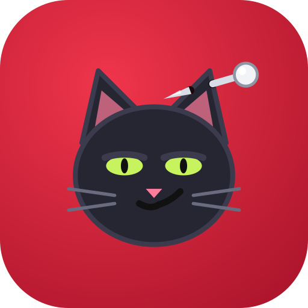
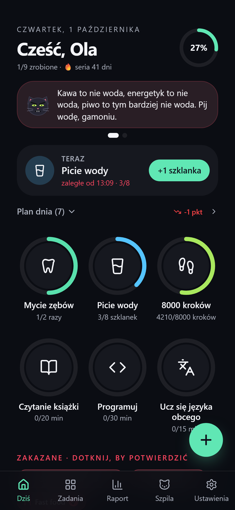
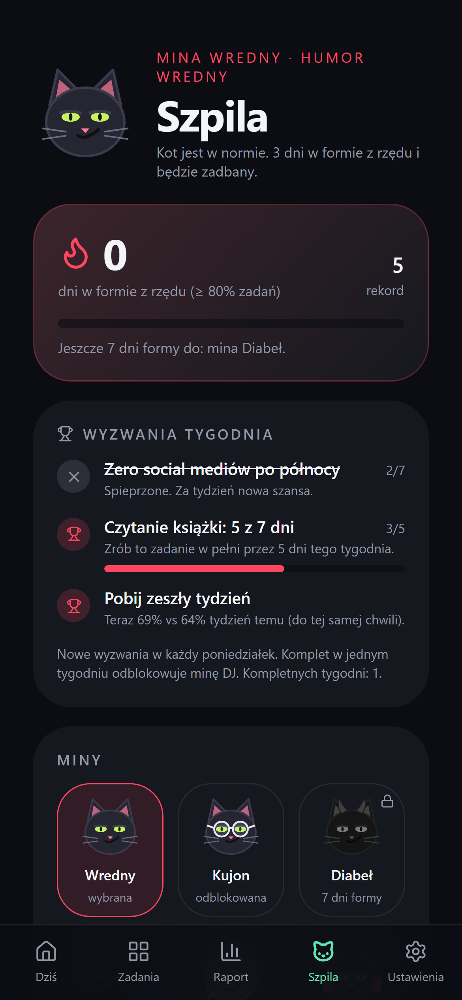
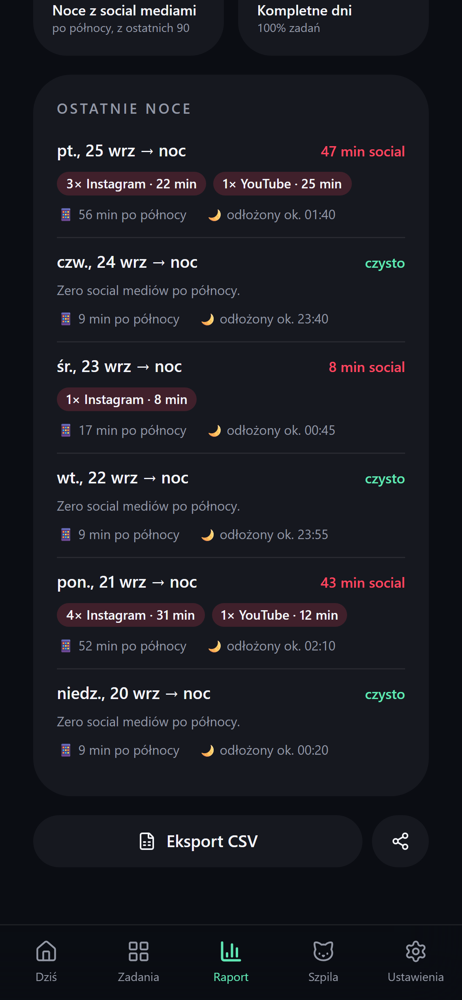
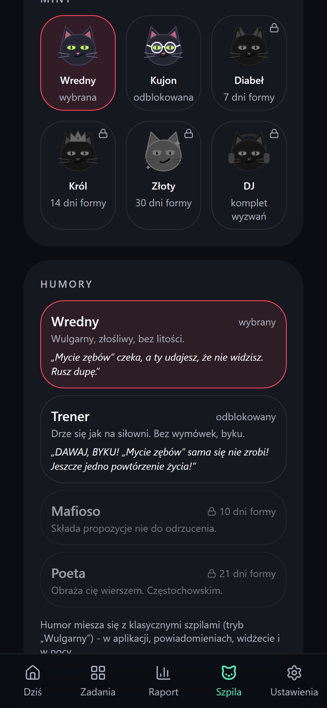
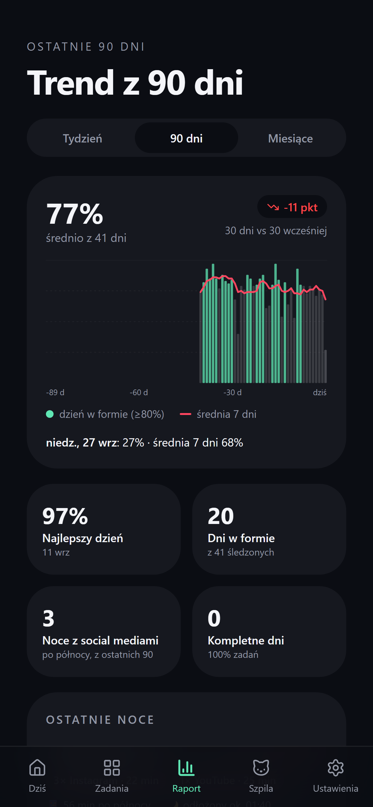
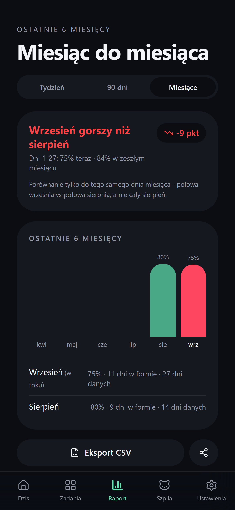
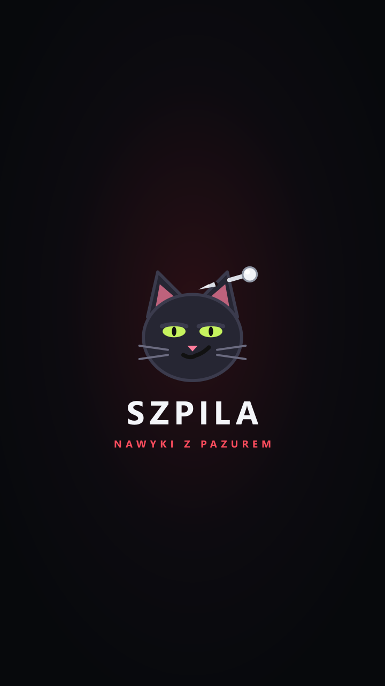

<div align="center">



# Szpila

**Nawyki z pazurem.**
Rób to, co chcesz robić. Rzuć to, czego nie chcesz. A jak odpuścisz, wredny kot ci o tym przypomni. Boleśnie.

<br />

[](https://github.com/pi0trdotsys/Glow-Habit-Widget/releases/latest)
&nbsp;

&nbsp;


<br />


&nbsp;&nbsp;

&nbsp;&nbsp;


</div>

<br />

## ◉ Szpila 😼

Wredny kot, który mieszka w twoim telefonie. Wbija szpile, gdy zadania leżą
odłogiem, i ma tekst na wszystko: na nieumyte zęby, na 2000 kroków o 18:00,
na frytki. Im dłużej zwlekasz, tym ostrzej. Pamięta twoje wpadki. W niedzielę
robi podsumowanie tygodnia, którego nie chcesz czytać.

Zrobisz swoje, dostaniesz pochwałę. Złośliwą, ale zawsze.

> **Szpila domyślnie przeklina.** Wolisz grzeczniej? Ustawienia → **„Łagodny”**.
> Do tego 3, 5 albo 8 szpil dziennie i godziny ciszy.

## ◉ Po północy nie ma zmiłuj

Otwierasz TikToka o 0:40? **Szpila wyskakuje od razu**, a nie dopiero rano.
Tekst pod konkretną aplikację, a co 5 minut ostrzej.

Nie pomogło? Po trzeciej szpili kot **zasłania całą aplikację**.
Do wyboru: **„Idę spać”** albo **przytrzymaj guzik 10 sekund**, jeśli naprawdę
musisz. I spójrz sobie przy tym w oczy.

Rano czeka **rachunek za noc**: *„3× Instagram (22 min) · 1× YouTube (25 min)
· 61 min z telefonem po północy · telefon odłożony ok. 1:40”*. Z komentarzem.

„Scrollowanie w łóżku” ocenia się samo i uczciwie: liczą się **tylko social
media**. Budzik, muzyka i podcast do snu to nie wpadka.

## ◉ Kot, który rośnie razem z tobą

- **Dzień w formie** = co najmniej 80% zadań. Seria takich dni odblokowuje
  **nowe miny** (Kujon, Diabeł, Król, Złoty, DJ) i **humory**. Trener drze się
  jak na siłowni, Mafioso składa propozycje nie do odrzucenia, a Poeta
  obraża cię wierszem.
- **Trzy wyzwania tygodnia**, nowe w każdy poniedziałek: 5 z 7 dni, czysty
  tydzień, zero social mediów po północy, pobicie zeszłego tygodnia.
- **Kot w domu**: z serią jest zadbany, błyszczący i w muszce. Po tygodniu
  wpadek jest zaniedbany, potargany, z plastrem i obrażony. Widać to też na
  widżecie.

<div align="center">

&nbsp;&nbsp;

&nbsp;&nbsp;

</div>

## ◉ Dzień, który układa się sam

Otwierasz aplikację i widzisz tylko to, co ważne: postęp dnia, jedną szpilę i
**jedno zadanie na teraz**. Resztę dnia chowa zwijany **plan**. Osiem
szklanek wody? Rozłożone równo od rana do wieczora.

Przytrzymaj kafelek i zadanie zaliczone. Ile razy, ile minut, ile kroków,
ustawiasz po swojemu.

## ◉ Zakazane. Na czerwono.

Fast food, scrollowanie w łóżku, słodycze, pornografia, pomijanie posiłków,
impulsywne zakupy, hazard. Dodaj to, czego **nie** chcesz robić, i ustaw limit,
np. „najwyżej raz w tygodniu”.

Zasada jest prosta i bezlitosna: codziennie potwierdzasz **„dziś czysto”**.
Brak potwierdzenia = wpadka. Wczoraj rozliczysz jeszcze rano, do 12:00.

## ◉ Liczby, które mówią prawdę

- **Tydzień do tygodnia**, ale uczciwie: środa 14:35 kontra środa 14:35 sprzed
  tygodnia, a nie cały zakończony tydzień.
- **Trend z 90 dni** ze średnią z 7 dni i porównaniem ostatnich 30 dni z
  poprzednimi 30.
- **Miesiąc do miesiąca** do tego samego dnia i 6 miesięcy na jednym wykresie.
- **Powiązania między nawykami**: *„Dzień po nocy z telefonem robisz o 4000
  kroków mniej”*.
- **Eksport do CSV** jednym dotknięciem, prosto do Excela albo Arkuszy.

## ◉ Bez otwierania aplikacji

- **Cztery widżety**: wredny kot 4×1, następne zadanie 1×1, ikony z
  pierścieniem postępu i lista. Zaliczasz przytrzymaniem, więc przypadkowe
  dotknięcie niczego nie psuje.
- **Stałe powiadomienie** z paskiem postępu, planem i szybkimi przyciskami:
  **„+1 szklanka”**, **„+15 min Czytanie”**, **„✓ Mycie”**.
- **Wieczorne rozliczenie** zakazanych jednym powiadomieniem.
- **Kroki z Health Connect**: Google Fit, Samsung Health czy Mi Fitness wpisują je za ciebie.

<br />

---

<br />

## ▸ Instalacja

1. Pobierz plik **`szpila-….apk`** z [Releases](https://github.com/pi0trdotsys/Glow-Habit-Widget/releases/latest).
2. Otwórz go na telefonie i zezwól na instalację z tego źródła.
3. Uruchom Szpilę, podaj imię i zgódź się na powiadomienia.

Na start dostajesz gotowe zadania: mycie zębów, wodę, 8000 kroków, czytanie,
programowanie, naukę języka, scrollowanie w łóżku i fast food. Zmieniasz je,
usuwasz albo dodajesz własne z ponad 20 szablonów.

> **Masz Loop 2.x?** To ta sama aplikacja pod nową nazwą. Instaluj na
> obecną, a dane zostaną. Z wersji 1.x najpierw odinstaluj starą.

## ▸ Pierwsze 2 minuty, które robią różnicę

| | Gdzie | Po co |
|---|---|---|
| 🔔 | Zgoda na powiadomienia | Szpile, pasek postępu, rachunek za noc |
| 📱 | Ustawienia → Automatyczne śledzenie → **Otwórz** | Szpila na żywo, rachunek za noc, uczciwa ocena scrollowania |
| 🛑 | Ustawienia → Szpila na żywo → **Zezwól** | Pełnoekranowa blokada po 3. szpili |
| 👣 | Ustawienia → Automatyczne śledzenie → **Połącz** | Kroki wpisują się same |
| 🔋 | Ustawienia systemu → Bateria → Szpila → **Bez ograniczeń** | Szpile i nocny strażnik działają punktualnie (szczególnie Xiaomi, POCO, Samsung) |
| ➕ | Przytrzymaj ekran główny → **Widżety** → Szpila | Kot zawsze na widoku |

## ▸ Twoje dane są twoje

Wszystko zostaje na telefonie. Bez konta, bez chmury, bez reklam, bez
śledzenia. Szpila codziennie robi kopię do **Pobrane/Szpila** (ostatnie 7 dni).
Kopię możesz też zapisać ręcznie, wysłać na Dysk albo mailem i przywrócić
jednym dotknięciem.

<br />

<div align="center">

**Szpila** · nawyki z pazurem



</div>

<br />

<details>
<summary><b>Dla programistów</b></summary>

<br />

React 19 + TanStack Start + Tailwind v4 w powłoce **Capacitor 8**. Widżety,
powiadomienia, nocny strażnik (foreground service + usage stats), blokada
(nakładka nad aplikacjami), Health Connect i czas ekranu są natywne
(Java/Kotlin). Dane żyją w `localStorage` i są lustrzane do
`SharedPreferences`, skąd czyta je strona natywna
([`src/lib/widget/bridge.ts`](src/lib/widget/bridge.ts)).

```bash
bun install
bun run dev              # web, http://localhost:8080
bun run test             # testy logiki (planer, zakazane, grywalizacja, statystyki, noce, kopie)
bun run test:e2e         # build + testy na zbudowanej aplikacji w headless Edge/Chrome

bun run build:cap        # statyczny build dla Capacitora
bun x cap sync android
cd android
./gradlew :app:assembleRelease
./gradlew testReleaseUnitTest   # logika natywna, m.in. planer musi liczyć jak TS (tests/planner-vectors.json)
```

Podpis: `android/keystore.properties` (poza gitem; `storeFile`, `storePassword`,
`keyAlias`, `keyPassword`). Jeden klucz dla wszystkich buildów, więc
aktualizacje instalują się bez odinstalowania. Wymagany JDK 21.

</details>
