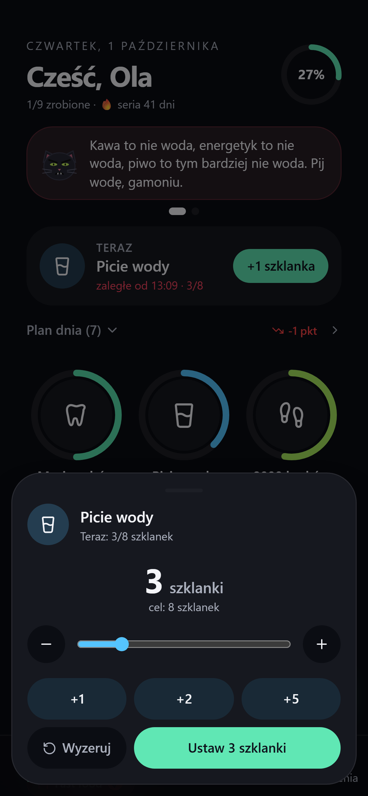
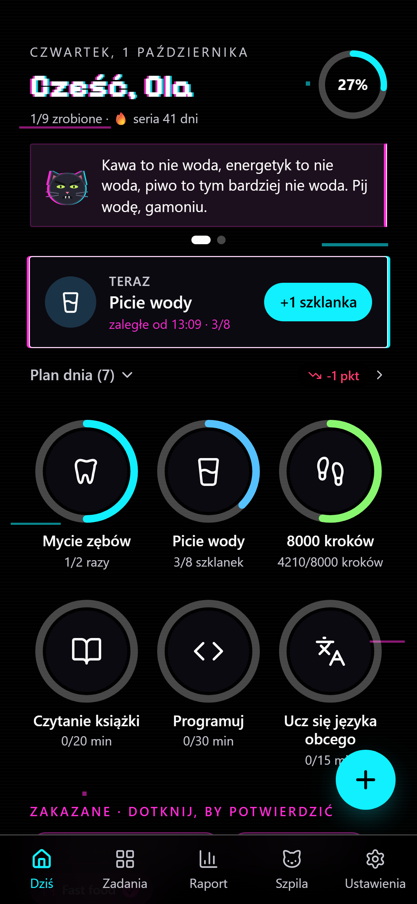
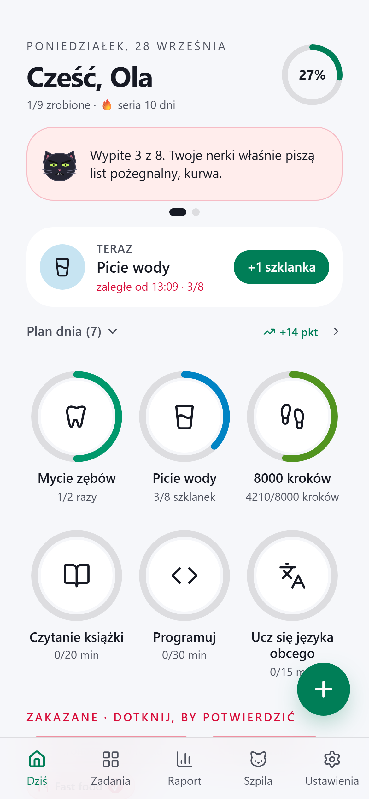
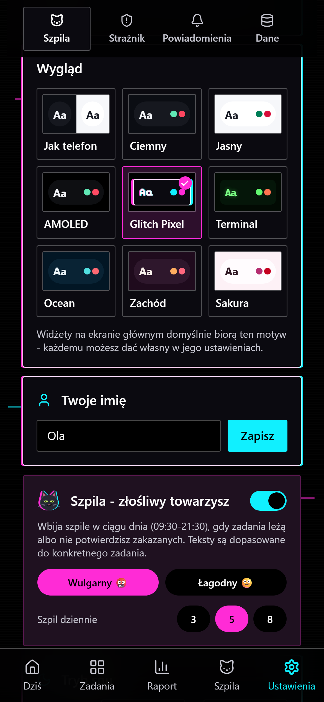

<div align="center">


# Szpila

**Nawyki z pazurem.**
Rób to, co chcesz robić. Rzuć to, czego nie chcesz. A jak odpuścisz, wredny kot ci o tym przypomni. Boleśnie.

**Polski** · [English](README.en.md)

<br />

[](https://github.com/pi0trdotsys/Glow-Habit-Widget/releases/latest)
&nbsp;

&nbsp;


<br />


&nbsp;&nbsp;

&nbsp;&nbsp;


</div>

<br />

## ◉ Szpila 😼

Wredny kot, który mieszka w twoim telefonie. Wbija szpile, gdy zadania leżą
odłogiem, i ma tekst na wszystko: na nieumyte zęby, na 2000 kroków o 18:00,
na frytki. Im dłużej zwlekasz, tym ostrzej. Pamięta twoje wpadki. W niedzielę
robi podsumowanie tygodnia, którego nie chcesz czytać.

Ponad 1500 tekstów, dopasowanych do zadania i do sytuacji: inaczej rano przy
pustym kubku, inaczej o 15:00, gdy dalej zero, inaczej przy 7 z 8 szklanek, a
jeszcze inaczej wieczorem. Programowanie, nauka języka, wydatki, posiłki,
porno - każde ma swój repertuar.

Zrobisz swoje, dostaniesz pochwałę. Złośliwą, ale zawsze.

> **Szpila domyślnie przeklina.** Wolisz grzeczniej? Ustawienia → Szpila → **„Łagodny”**.
> Do tego 3, 5 albo 8 szpil dziennie i godziny ciszy.

## ◉ Po północy nie ma zmiłuj

**Tryb przed snem.** O 23:30 Szpila mówi _„odłóż telefon za 30 min”_ i od razu
zaczyna pilnować, odliczając do północy.

Otwierasz TikToka o 0:40? **Szpila wyskakuje od razu**, a nie dopiero rano.
Tekst pod konkretną aplikację, a co 5 minut ostrzej.

Nie pomogło? Po trzeciej szpili kot **zasłania całą aplikację** (przed
północą już po drugiej). Do wyboru: **„Idę spać”** albo **przytrzymaj guzik
10 sekund**, jeśli naprawdę musisz. I spójrz sobie przy tym w oczy.

**Cisza nocna.** Chcesz po północy w ogóle nie siedzieć w telefonie? Od 0:00
działa tylko budzik, telefon, ekran główny i to, co sam dopuścisz (np. muzyka
do snu). Każda inna aplikacja zasłania się od razu. Bo o północy z algorytmem
nie wygrasz, więc lepiej nie musieć z nim walczyć:

- **Pilne?** Przytrzymaj 10 s, a dostaniesz 3 minuty przy ciemniejącym na
  czerwono ekranie. Każdy kolejny raz tej nocy trzymasz dwa razy dłużej.
- **Noc kosztuje dzień.** Każda minuta social mediów po północy zabiera 2
  minuty z jutrzejszego limitu, każdy wyjątek 10 minut.
- **Ładowarka.** Telefon podłączony wieczorem = pochwała i godzina w
  rachunku. Odłączony po północy = szpila.
- **Seria czystych nocy** na rachunku. Szkoda ją przerwać.

Rano czeka **rachunek za noc**: _„3× Instagram (22 min) · 1× YouTube (25 min)
· 61 min z telefonem po północy · telefon odłożony ok. 1:40”_. Z komentarzem.

„Scrollowanie w łóżku” ocenia się samo i uczciwie: liczą się **tylko social
media**. Budzik, muzyka i podcast do snu to nie wpadka. Liczą się tylko
prawdziwe sesje z telefonem: powiadomienie, które zapali ekran, albo
zaplanowane wyłączenie telefonu nie udają, że nie śpisz.

## ◉ W dzień też

- **Rano najpierw zadania, potem Instagram.** Od 5:00 social media są
  zablokowane, dopóki nie odhaczysz porannych zadań (domyślnie zęby i pierwsza
  szklanka wody). Odhaczasz je prosto z blokady.
- **Dzienny limit**, np. 60 minut social mediów. Za 10 minut do końca
  ostrzeżenie, po limicie szpile, a po trzeciej blokada. Na ekranie Dziś
  widzisz licznik _„42/60 min”_ (minus to, co zabrała noc), a w raporcie, w ilu
  dniach udało się zmieścić w limicie.

## ◉ Kot, który rośnie razem z tobą

- **Dzień w formie** = co najmniej 80% zadań. Seria takich dni odblokowuje
  **nowe miny** (Kujon, Diabeł, Król, Złoty, DJ) i **humory**. Trener drze się
  jak na siłowni, Mafioso składa propozycje nie do odrzucenia, a Poeta
  obraża cię wierszem.
- **Trzy wyzwania tygodnia**, nowe w każdy poniedziałek: 5 z 7 dni, czysty
  tydzień, zero social mediów po północy, pobicie zeszłego tygodnia.
- **Kot w domu**: z serią jest zadbany, błyszczący i w muszce. Po tygodniu
  wpadek jest zaniedbany, potargany, z plastrem i obrażony. Widać to też na
  widżecie.

<div align="center">

&nbsp;&nbsp;

&nbsp;&nbsp;

</div>

## ◉ Dzień, który układa się sam

Otwierasz aplikację i widzisz tylko to, co ważne: postęp dnia, **jedną kartę
stanu** (szpila, rachunek za noc, poranna blokada, limit - przesuwasz w bok) i
**jedno zadanie na teraz**. Resztę dnia chowa zwijany **plan**. Osiem
szklanek wody? Rozłożone równo od rana do wieczora.

- **Przytrzymaj** kafelek: +1 i gotowe.
- **Trzymaj dłużej**: +1 / +2 / +5 albo suwak, żeby wpisać ilość jednym ruchem.
- **Przesuń w bok**: cofasz ostatni wpis.
- Wibracja przy każdym kroku, **konfetti przy komplecie dnia**, a kot na
  karcie cieszy się z każdego zaliczenia.

<div align="center">

&nbsp;&nbsp;

&nbsp;&nbsp;

</div>

## ◉ Zakazane. Na czerwono.

Fast food, scrollowanie w łóżku, słodycze, pornografia, pomijanie posiłków,
impulsywne zakupy, hazard. Dodaj to, czego **nie** chcesz robić, i ustaw limit,
np. „najwyżej raz w tygodniu”.

Zasada jest prosta i bezlitosna: codziennie potwierdzasz **„dziś czysto”**.
Brak potwierdzenia = wpadka. Wczoraj rozliczysz jeszcze rano, do 12:00.

## ◉ Liczby, które mówią prawdę

- **Tydzień do tygodnia**, ale uczciwie: środa 14:35 kontra środa 14:35 sprzed
  tygodnia, a nie cały zakończony tydzień.
- **Trend z 90 dni** ze średnią z 7 dni i porównaniem ostatnich 30 dni z
  poprzednimi 30.
- **Miesiąc do miesiąca** do tego samego dnia i 6 miesięcy na jednym wykresie.
- **Powiązania między nawykami**: _„Dzień po nocy z telefonem robisz o 4000
  kroków mniej”_.
- **Eksport do CSV** jednym dotknięciem, prosto do Excela albo Arkuszy.

## ◉ Bez otwierania aplikacji

- **Cztery widżety**: wredny kot 4×1, następne zadanie 1×1 albo 2×1 (z kotem,
  opóźnieniem i zmieniającą się linijką: szpila, seria, postęp, limit, co
  potem), ikony z pierścieniem postępu i lista. Zaliczasz przytrzymaniem, więc
  przypadkowe dotknięcie niczego nie psuje.
- **Ustawienia widżetu** przy dodawaniu: motyw, przezroczystość tła pod twoją
  tapetę i co ma pokazywać zmieniająca się linijka.
- **Stałe powiadomienie** z paskiem postępu, planem i szybkimi przyciskami:
  **„+1 szklanka”**, **„+15 min Czytanie”**, **„✓ Mycie”**.
- **Wieczorne rozliczenie** zakazanych jednym powiadomieniem.
- **Kroki z opaski**: Mi Fitness (Xiaomi Smart Band), Google Fit, Samsung
  Health czy Garmin wpisują je za ciebie przez Health Connect. Widzisz, ile
  naliczyło każde źródło, wybierasz jedno albo „automatycznie”, a przycisk
  **„Zsynchronizuj opaskę”** otwiera Mi Fitness. Zadanie liczone w tysiącach
  („8 × 1000”) podłączasz jednym dotknięciem, razem z historią.

## ◉ Polski i English, dziewięć motywów

Cała aplikacja, szpile (tak, przekleństwa też), powiadomienia i widżety mówią
**po polsku i po angielsku**. Język wybierasz przy pierwszym uruchomieniu albo
w każdej chwili w Ustawieniach.

Motywy: **Jak telefon, Ciemny, Jasny, AMOLED, Glitch Pixel** (pikselowa
czcionka i rozszczepienie magenta/cyjan), **Terminal, Ocean, Zachód i
Sakura**. Widżety biorą motyw aplikacji albo każdy swój. Ustawienia są
podzielone na cztery zakładki: Szpila, Strażnik, Powiadomienia, Dane.

<div align="center">

</div>

<br />

---

<br />

## ▸ Instalacja

1. Pobierz plik **`szpila-….apk`** z [Releases](https://github.com/pi0trdotsys/Glow-Habit-Widget/releases/latest).
2. Otwórz go na telefonie i zezwól na instalację z tego źródła.
3. Uruchom Szpilę, wybierz język, podaj imię i zgódź się na powiadomienia.

Na start dostajesz gotowe zadania: mycie zębów, wodę, 8000 kroków, czytanie,
programowanie, naukę języka, scrollowanie w łóżku i fast food. Zmieniasz je,
usuwasz albo dodajesz własne z ponad 20 szablonów.

> **Masz Loop 2.x?** To ta sama aplikacja pod nową nazwą. Instaluj na
> obecną, a dane zostaną. Z wersji 1.x najpierw odinstaluj starą.

## ▸ Pierwsze 2 minuty, które robią różnicę

|     | Gdzie                                                       | Po co                                                                            |
| --- | ----------------------------------------------------------- | -------------------------------------------------------------------------------- |
| 🔔  | Zgoda na powiadomienia                                      | Szpile, pasek postępu, rachunek za noc                                           |
| 📱  | Ustawienia → Strażnik → Automatyczne śledzenie → **Otwórz** | Szpila na żywo, rachunek za noc, poranek, limit dzienny                          |
| 🛑  | Ustawienia → Strażnik → Szpila na żywo → **Zezwól**         | Pełnoekranowa blokada po 3. szpili                                               |
| 🌙  | Ustawienia → Strażnik → **Cisza nocna**                     | Po północy działa tylko budzik, telefon i to, co dopuścisz                       |
| 🌅  | Ustawienia → Strażnik → **Social media w dzień**            | Poranne zadania i dzienny limit                                                  |
| 👣  | Ustawienia → Strażnik → Automatyczne śledzenie → **Połącz** | Kroki z opaski wpisują się same (w Mi Fitness: Profil → Health Connect)          |
| 🔋  | Ustawienia systemu → Bateria → Szpila → **Bez ograniczeń**  | Szpile i nocny strażnik działają punktualnie (szczególnie Xiaomi, POCO, Samsung) |
| ➕  | Przytrzymaj ekran główny → **Widżety** → Szpila             | Kot zawsze na widoku                                                             |

## ▸ Twoje dane są twoje

Wszystko zostaje na telefonie. Bez konta, bez chmury, bez reklam, bez
śledzenia. Szpila codziennie robi kopię do **Pobrane/Szpila** (ostatnie 7 dni).
Kopię możesz też zapisać ręcznie, wysłać na Dysk albo mailem i przywrócić
jednym dotknięciem.

<br />

<div align="center">

**Szpila** · nawyki z pazurem


</div>

<br />

<details>
<summary><b>Dla programistów</b></summary>

<br />

React 19 + TanStack Start + Tailwind v4 w powłoce **Capacitor 8**. Widżety,
powiadomienia, nocny strażnik (foreground service + usage stats), blokada
(nakładka nad aplikacjami), Health Connect i czas ekranu są natywne
(Java/Kotlin). Dane żyją w `localStorage` i są lustrzane do
`SharedPreferences`, skąd czyta je strona natywna
([`src/lib/widget/bridge.ts`](src/lib/widget/bridge.ts)). Tłumaczenia są
w kodzie: `L("polski", "English")` ([`src/lib/i18n.ts`](src/lib/i18n.ts)),
po stronie natywnej `WidgetShared.tr()`.

```bash
bun install
bun run dev              # web, http://localhost:8080
bun run test             # testy logiki (planer, zakazane, grywalizacja, statystyki, noce, strażnik, i18n, UX)
bun run test:e2e         # build + testy na zbudowanej aplikacji w headless Edge/Chrome

bun run build:cap        # statyczny build dla Capacitora
bun x cap sync android
cd android
./gradlew :app:assembleRelease
./gradlew testReleaseUnitTest   # logika natywna, m.in. planer musi liczyć jak TS (tests/planner-vectors.json)
```

Podpis: `android/keystore.properties` (poza gitem; `storeFile`, `storePassword`,
`keyAlias`, `keyPassword`). Jeden klucz dla wszystkich buildów, więc
aktualizacje instalują się bez odinstalowania. Wymagany JDK 21.

</details>
